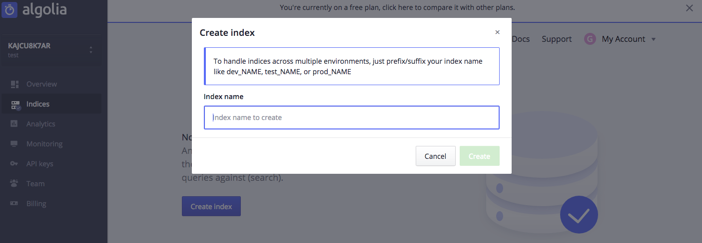
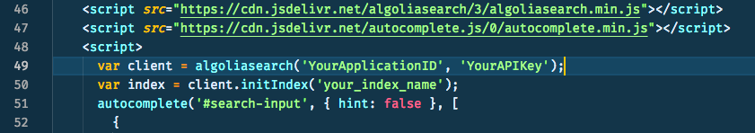
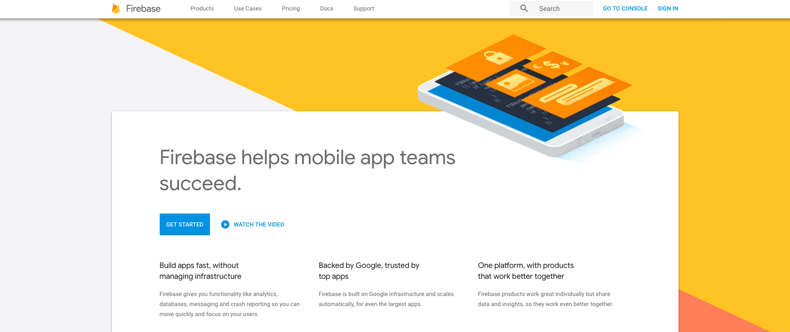
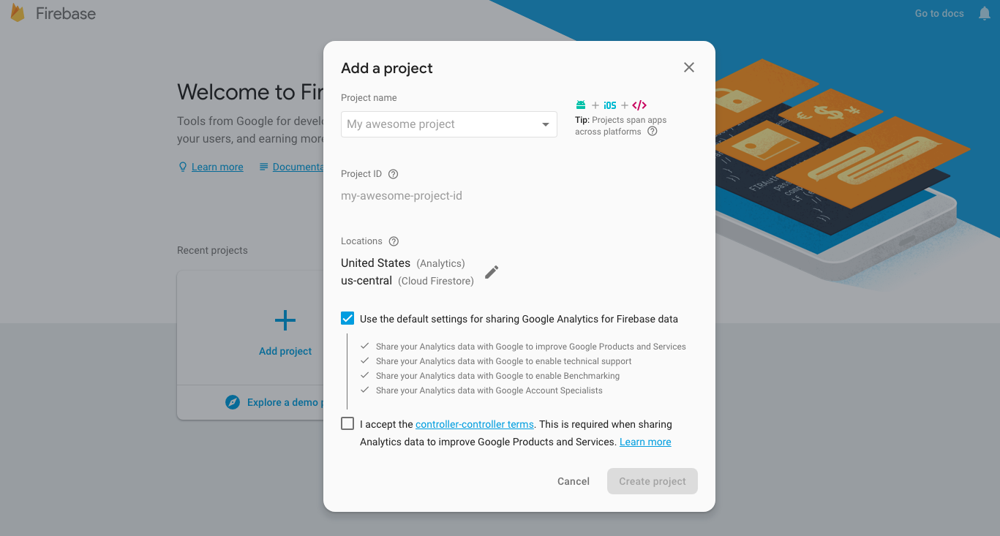
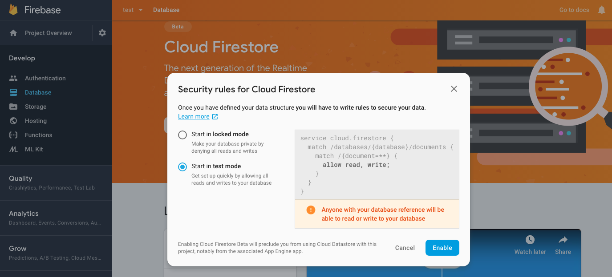
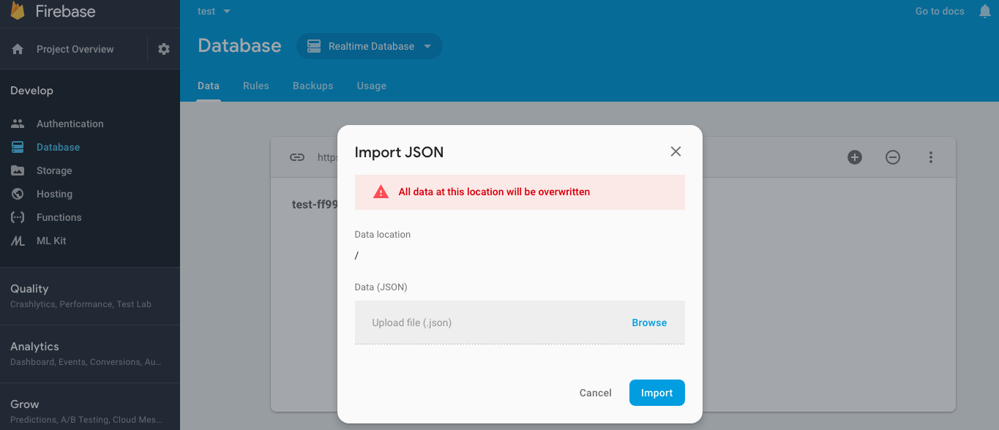
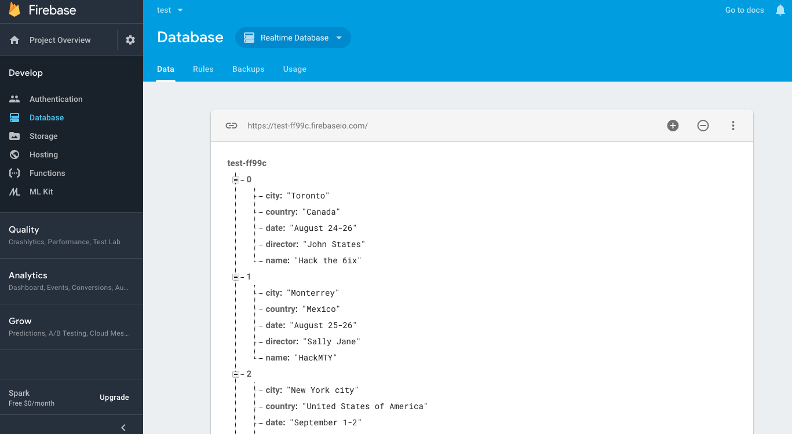
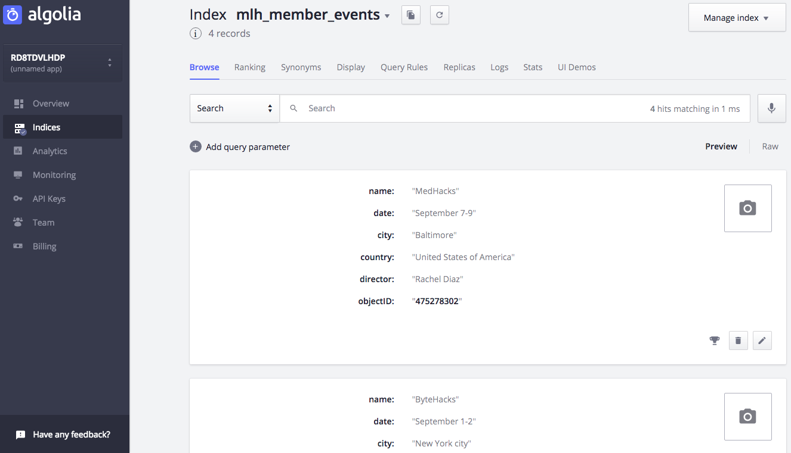

# Creating an auto-completing search bar with Algolia and Firebase

Search is a critical part of the modern web. There's no need to reinvent the wheel when it comes to building this functionality into your website or web app. There are some awesome APIs out there that will help you focus on writing code rather than worrying about search! Today I'm going to show you how to use [**Algolia**](https://www.algolia.com/) and [**Firebase**](https://firebase.google.com/) to create a simple auto-completing search bar.

This tutorial uses Firebase as an application database and then demonstrates how to import that data into Algolia for super powered search.

Let's get started. Here's the Algolia home page! Algolia is a powerful API that allows you to easily implement a search engine within your websites and mobile applications. With Algolia, you can get relevant search results in milliseconds, as its speed is unparalleled to any other search API. Moreover, Algolia can be integrated with any application — thus you don’t have to worry about compatibility between your framework and the API.

In this tutorial, you'll use Algolia to create a search bar that auto-completes based on the user input. We'll be searching MLH's database of hackathons.

## Setup

### 1. Sign up for an Algolia account

First things first. you'll need an Algolia account to create our search index.

Follow [**this link**](https://www.algolia.com/users/sign_up) to create your Algolia account!

Algolia offers a completely free account in their Community tier. This is great because you're able to get full API functionality for development purposes without supplying any payment information.

### 2. Find your API credentials

After successfully creating your account, click on ***Go to dashboard***. 

Then, click on ***API Keys*** in the left-hand column of your dashboard to find your API credentials. You'll need them in a few minutes!  These credentials are sent along with your search requests in order to tell the Algolia servers which developer account the activity is associated with.

*Note:  Your Admin API Key is secret! Don't share it publicly or post it online.*

### 3. Create an Algolia search index

Now you'll make an index. An index helps search functionality perform at lightening speed. Indexes help quickly locate data in large datasets by creating an efficient lookup table.

To create an index, click on ***Indices*** in the left-hand column of your dashboard and then click the ***Create index*** button. Enter a name for your index and then click the ***Create*** button.

## Getting Started

### 4. Create our webpage
 
Download the example ***index.html*** file needed to create our search page. This is a very simple HTML file that uses the Algolia Javascript package and `autocomplete.js` together to create an auto-completing search bar. 

https://gist.github.com/haxorgist/06b5554b93a327c143cd52eb1a74a151#file-index-html

The start of the show is the singular input called "search-input" which will be used for our Algolia search. When input is given to the search bar, the `algoliasearch` package is used to access the Algolia index. Then the index is fed into `autocomplete.js` to render the search suggestion.

When a search suggestion is selected, an alert is fired in the window informing the user of their selection. In practice, this would probably navigate to another page where search results are displayed.

### 5. Insert your API credentials and index name

Grab the API credentials from the ***API Keys*** section of your Algolia dashboard and insert them into the appropriate spots in the code (`YourApplicationID` and `YourAPIKey`). ***Make sure to use the Algolia Admin API key***

Then, insert the index name you created earlier into the appropriate spot in the code (`your_index_name`).

Save the ***index.html*** file.

### 6. Testing it out
 
Open `index.html` in your favorite browser to see our search bar.

Alternatively, you can publish your page on the web with [**CodePen**](https://codepen.io/). Create a new pen and pasting in the contents of your ***index.html*** file.

If all went well, you should see a page similar to the following:

The autocomplete won't work just yet, as the Algolia index has not been populated.

## Connecting Firebase

### 7. Sign up for a Firebase account

Follow [**this link**](https://console.firebase.google.com/) to create your Firebase account! Firebase will act as our application database, where as Algolia will act as our search database.

*Note: Your Firebase account is tied to your Google account, so if you already have a Google account you can sign in with it.*

Firebase offers a completely free account for development and testing purposes. That's what you'll use for this tutorial.

### 8. Create a new Firebase Application

A Firebase application is a collection of cloud software that provide app developers with easy solutions to common problems. This tutorial will only make use of the database software.

- Click the ***Add project*** button in your Firebase dashboard.
- Enter a name for it.
- Click the ***Create project*** button.

### 9. Create a new database

- Click on ***Develop*** then ***Database*** in the left-hand column of your project dashboard.
- Click on the ***Create database*** button. 
- Choose the radio button to ***Start in test mode***.
- Click the ***Enable*** button.

### 10. Add your data to Firebase

Download the example ***hackathons.json*** file needed to create our database.

https://gist.github.com/haxorgist/06b5554b93a327c143cd52eb1a74a151#file-hackathons-json

Now import the JSON file into the Firebase database.

- Click on the dropdown next to ***Database*** and choose the ***Realtime Database*** option.
- Click on the ***more*** button (the vertical ellipsis).
- Click on ***Import JSON***.
- Browse to the ***mlh_member_events.json*** file you downloaded and click the ***Import*** button.

Click on the ***Expand data*** button (the plus symbol). If all went well, you should see the example data imported into your database similar to the following:

Take note of the database url found in the header above your data. This will be used in the Node.js script.

Finally, click on ***Rules*** and enable public read access by setting '".read": true' in the JSON object. Click ***Public*** to save the rule set. This allows our Node.js application to read the Firebase data.

https://gist.github.com/haxorgist/06b5554b93a327c143cd52eb1a74a151#file-firebase-permissions-json

### 11. Create a Node.js import script

Now create a Node.js script to import the Firebase data into Algolia.

*Note: If you haven't used Node.js before, go to [**this link**](https://nodejs.org/en/download/) to install it on your system.* This tutorial was written using node v8.12.0.

- Create a new folder.
- Run `npm init` from the command line inside of the new folder.
- Accept the defaults in the wizard (just keep pressing ***Enter***) to create a ***package.json*** file.
- Run `npm install dotenv algoliasearch firebase --save` from the command line inside of the new folder.

The package `dotenv` is used to keep your API keys secret and only on your machine. `algoliasearch` is used to work with Algolia, and `firebase` works with the Firebase dataabse.

### 12. Configure your environment

Now make a `.env` file. This ensures that your secret API keys never leave your system and do not appear in code.

Download the example ***.env*** file needed to set up our environment. Save this file to the same folder index.js is located in.

https://gist.github.com/haxorgist/06b5554b93a327c143cd52eb1a74a151#file-env

- Insert your Algolia API credentials, Algolia index name and Firebase database URL into this file.
- Save this file into the same folder that you ran the `npm init` command in.

### 13. Create a main index.js file

This will be the main NodeJS script to import our data from Firebase into Algolia.

Download the example ***index.js*** file needed for our Node.js application:

https://gist.github.com/haxorgist/06b5554b93a327c143cd52eb1a74a151#file-index-js

- Save this file into the same folder that you ran the `npm init` command in.
- Run `node index.js` from the command line inside of the same folder.

If everything goes right, you should see a success message in your console!

## Verifying and Testing

### 14. Verify the synchronization

Click on ***Indices*** in the left-hand column on your Algolia dashboard.

If all went well, you should see the example data from Firebase synchronized similar to the following:

### 15. Test the search

Load your GitHub Page or your CodePen Pen that you created earlier, then try typing in the search box.

If all went well, you should see results from the example data similar to the following:

Congratulations! Your auto-completing search bar is working.

## Auto Update Algolia when Firebase Data Changes

### 17. Modify index.js file

Now that the Firebase data has been imported, we want to keep it in sync as it changes. Modifying the `index.js` Node.js script to subscribe to Firebase updates will keep Algolia in sync as Firebase data changes.

To do this, subscribe to the `child_added`, `child_changed`, and `child_removed` events. The Node.js script will be notified when Firebase data changes. Then, use the `algoliasearch` package to update Algolia with the new data.

Remove everything from the bottom of the ***index.js*** file starting from the line beginning with `// Get all contacts from Firebase` and replace it with the following code:

https://gist.github.com/haxorgist/06b5554b93a327c143cd52eb1a74a151#file-index-live-update-js

Save the file and run it. Now as data is updated in Firebase, it will be synced with Algolia. Rather than keep this running on your local machine, you may want to deploy the script to a cloud service like [**Heroku**](https://devcenter.heroku.com/articles/getting-started-with-nodejs) to keep it running all the time.

Congratulations!  You've built a simple search page using the Algolia API with Firebase as your database. 

I hope you enjoyed this tutorial on using [**Algolia**](https://www.algolia.com/)'s API to power search in your website.

The full source code is [**available on GitHub here**](https://github.com/HaxorDigital/algolia-autocomplete)!